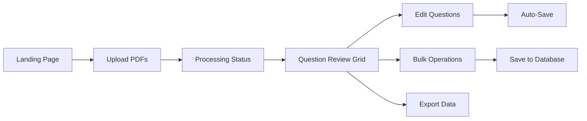

# Frontend Design - PDF Question Extractor

## Overview
Single-page application using vanilla HTML5/CSS3/JavaScript with Tabulator.js for data grid functionality. Clean, responsive design focused on usability and efficiency.

## UI Flow Diagram



## Page Layout

### Overall Structure
```
┌─────────────────────────────────────────────────────────────┐
│                      Header Bar                              │
│  [Logo] PDF Question Extractor        [Help] [Settings]     │
├─────────────────────────────────────────────────────────────┤
│                                                             │
│                    Main Content Area                        │
│                                                             │
├─────────────────────────────────────────────────────────────┤
│                      Status Bar                             │
│  [Questions: 150] [Approved: 120] [Status Messages]        │
└─────────────────────────────────────────────────────────────┘
```

## Component Design

### 1. Upload Section
```
┌─────────────────────────────────────────────────────────────┐
│                    Upload PDF Files                         │
├─────────────────────────────────────────────────────────────┤
│                                                             │
│     ┌─────────────────────────────────────┐               │
│     │                                       │               │
│     │     Drag & Drop PDF Files Here       │               │
│     │              - or -                   │               │
│     │        [Choose Files...]              │               │
│     │                                       │               │
│     └─────────────────────────────────────┘               │
│                                                             │
│     Selected Files:                                         │
│     • exam_2023.pdf (2.3 MB)                              │
│     • test_paper_2024.pdf (1.8 MB)                        │
│     • quiz_questions.pdf (945 KB)                         │
│                                                             │
│                    [Process Files]                          │
│                                                             │
└─────────────────────────────────────────────────────────────┘
```

### 2. Processing Status (Real-time Updates)
```
┌─────────────────────────────────────────────────────────────┐
│                   Processing Status                         │
├─────────────────────────────────────────────────────────────┤
│                                                             │
│  Overall Progress: [████████████░░░░░░░] 60%               │
│                                                             │
│  ┌─────────────────────────────────────────────────┐      │
│  │ exam_2023.pdf         [██████████] Complete ✓   │      │
│  │ test_paper_2024.pdf   [████████░░] Processing.. │      │
│  │ quiz_questions.pdf    [░░░░░░░░░░] Pending     │      │
│  └─────────────────────────────────────────────────┘      │
│                                                             │
│  Questions Extracted: 45                                    │
│  Estimated Time Remaining: 2 minutes                       │
│                                                             │
└─────────────────────────────────────────────────────────────┘
```

### 3. Question Review Grid (Tabulator.js)
```
┌─────────────────────────────────────────────────────────────┐
│  Action Bar                                                 │
│  [Approve All] [Reject All] [Save Approved] [Export CSV]   │
├─────────────────────────────────────────────────────────────┤
│  Filters: [Status ▼] [Year ▼] [Type ▼] [Search...]        │
├─────────────────────────────────────────────────────────────┤
│                                                             │
│  ┌─┬────┬──────────────────┬─────┬──────┬──────┬─────┐   │
│  │✓│ Q# │ Question Text     │Marks│Topics│ Type │Year │   │
│  ├─┼────┼──────────────────┼─────┼──────┼──────┼─────┤   │
│  │☑│ 1a │Find the integral..│  5  │Calc..│Short │2023 │   │
│  │☐│ 1b │Differentiate f(x)│  3  │Calc..│MCQ   │2023 │   │
│  │☑│ 2  │Solve the matrix..│  8  │Algeb.│Essay │2023 │   │
│  │...│...│..................│ ... │......│......│.....│   │
│  └─┴────┴──────────────────┴─────┴──────┴──────┴─────┘   │
│                                                             │
│  [← Previous] Page 1 of 8 [Next →]  20 per page ▼         │
│                                                             │
└─────────────────────────────────────────────────────────────┘
```

### 4. Question Detail Modal (Double-click to open)
```
┌─────────────────────────────────────────────────────────────┐
│  Edit Question                                         [X]  │
├─────────────────────────────────────────────────────────────┤
│                                                             │
│  Question Number: [1a     ]  Marks: [5 ]                   │
│                                                             │
│  Question Text:                                             │
│  ┌─────────────────────────────────────────────────┐      │
│  │ Find the integral of x^2 + 2x + 1               │      │
│  │ with respect to x.                               │      │
│  └─────────────────────────────────────────────────┘      │
│                                                             │
│  Topics: [Calculus, Integration              ] [+]         │
│                                                             │
│  Type: [Short Answer ▼]    Year: [2023    ]               │
│                                                             │
│  Level: [A-Level     ▼]    Source: exam_2023.pdf          │
│                                                             │
│  Status: (•) Approved  ( ) Rejected  ( ) Pending          │
│                                                             │
│              [Cancel]  [Save Changes]                       │
│                                                             │
└─────────────────────────────────────────────────────────────┘
```

## Interactive Features

### 1. Drag & Drop Upload
- Visual feedback during drag
- File type validation (.pdf only)
- File size indication
- Multiple file selection
- Folder upload support

### 2. Real-time Processing Updates
- WebSocket connection for live updates
- Progress bars per file
- Overall progress indicator
- Error notifications
- Completion animations

### 3. Tabulator.js Grid Features
- **Inline Editing**: Click cell to edit
- **Column Sorting**: Click headers
- **Column Resizing**: Drag column borders
- **Row Selection**: Checkbox column
- **Pagination**: 20/50/100 per page
- **Filtering**: Per-column filters
- **Search**: Global search box
- **Keyboard Navigation**: Tab/Arrow keys

### 4. Auto-Save Mechanism
```javascript
// Visual feedback for auto-save
┌──────────────────────────┐
│ ✓ Auto-saved (1s ago)    │
└──────────────────────────┘

// Saving indicator
┌──────────────────────────┐
│ ⟳ Saving...             │
└──────────────────────────┘

// Error state
┌──────────────────────────┐
│ ⚠ Save failed - Retry?   │
└──────────────────────────┘
```

### 5. Bulk Operations
- Select all/none toggles
- Filtered selection (select all visible)
- Bulk status update
- Bulk delete (rejected questions)
- Progress indication for bulk ops

## UI States

### 1. Empty State
```
┌─────────────────────────────────────────────────────────────┐
│                                                             │
│                     No Questions Yet                        │
│                                                             │
│              Upload PDF files to get started                │
│                                                             │
│                    [Upload PDFs]                            │
│                                                             │
└─────────────────────────────────────────────────────────────┘
```

### 2. Loading State
```
┌─────────────────────────────────────────────────────────────┐
│                                                             │
│                    ⟳ Loading Questions...                   │
│                                                             │
│              [████████████░░░░░░░░] 60%                    │
│                                                             │
└─────────────────────────────────────────────────────────────┘
```

### 3. Error State
```
┌─────────────────────────────────────────────────────────────┐
│                                                             │
│                    ⚠ Error Loading Data                     │
│                                                             │
│         Failed to connect to server. Please retry.          │
│                                                             │
│                      [Retry]                                │
│                                                             │
└─────────────────────────────────────────────────────────────┘
```

## Responsive Design

### Desktop (1920x1080)
- Full layout with all features
- Multi-column grid view
- Side-by-side panels

### Tablet (768x1024)
- Condensed action bar
- Reduced columns in grid
- Modal dialogs for editing

### Mobile (375x667)
- Card-based question view
- Swipe actions (approve/reject)
- Bottom sheet for details
- Simplified upload interface

## Visual Design

### Color Palette
```css
:root {
  --primary: #2563eb;      /* Blue - Primary actions */
  --success: #16a34a;      /* Green - Approved/Success */
  --warning: #f59e0b;      /* Amber - Pending/Warning */
  --danger: #dc2626;       /* Red - Rejected/Error */
  --background: #ffffff;   /* White - Main background */
  --surface: #f3f4f6;      /* Light gray - Cards/sections */
  --text-primary: #111827; /* Dark gray - Main text */
  --text-secondary: #6b7280; /* Medium gray - Secondary text */
  --border: #e5e7eb;       /* Light gray - Borders */
}
```

### Typography
```css
/* Headings */
font-family: 'Inter', -apple-system, sans-serif;
h1: 24px/32px, font-weight: 700;
h2: 20px/28px, font-weight: 600;
h3: 16px/24px, font-weight: 600;

/* Body */
body: 14px/20px, font-weight: 400;
small: 12px/16px, font-weight: 400;

/* Monospace (questions) */
code: 'Monaco', 'Consolas', monospace;
```

### Component Styling
```css
/* Buttons */
.btn-primary {
  background: var(--primary);
  color: white;
  padding: 8px 16px;
  border-radius: 6px;
  font-weight: 500;
}

/* Cards */
.card {
  background: var(--surface);
  border: 1px solid var(--border);
  border-radius: 8px;
  padding: 16px;
  box-shadow: 0 1px 3px rgba(0,0,0,0.1);
}

/* Status badges */
.badge-approved { background: var(--success); }
.badge-pending { background: var(--warning); }
.badge-rejected { background: var(--danger); }
```

## Accessibility

### Keyboard Navigation
- Tab through all interactive elements
- Enter/Space to activate buttons
- Arrow keys in grid
- Escape to close modals
- Ctrl+S to save

### Screen Reader Support
- Semantic HTML structure
- ARIA labels and descriptions
- Live regions for updates
- Focus management
- Status announcements

### Visual Accessibility
- High contrast mode support
- Focus indicators
- Color-blind friendly palette
- Scalable fonts
- No color-only information

## Performance Optimization

### Initial Load
- Minimal CSS/JS (< 100KB)
- CDN for Tabulator.js
- Lazy load large datasets
- Service worker for offline

### Runtime Performance
- Virtual scrolling in grid
- Debounced auto-save
- Throttled search
- Request cancellation
- Optimistic UI updates

### Data Management
- Pagination (20 items default)
- Progressive data loading
- Client-side filtering/sorting
- IndexedDB for offline cache
- Memory cleanup

## Browser Support

### Required Features
- ES6+ JavaScript
- CSS Grid/Flexbox
- WebSocket
- FormData API
- FileReader API

### Supported Browsers
- Chrome 90+
- Firefox 88+
- Safari 14+
- Edge 90+

## Implementation Notes

### File Structure
```
static/
├── index.html          # Single page app
├── css/
│   └── style.css      # Custom styles
├── js/
│   ├── app.js         # Main application
│   ├── api.js         # API communication
│   ├── ui.js          # UI components
│   └── utils.js       # Helper functions
└── assets/
    └── logo.svg       # Application logo
```

### Key Libraries
- **Tabulator.js 5.5**: Data grid
- **No framework**: Vanilla JS for simplicity
- **No build process**: Direct browser execution

### State Management
```javascript
// Simple state object
const AppState = {
  questions: [],
  filters: {},
  selectedIds: new Set(),
  processing: false,
  autoSaveEnabled: true
};
```

### Event Flow
1. User actions → Event handlers
2. State updates → UI updates
3. API calls → Async handlers
4. WebSocket → Real-time updates
5. Auto-save → Debounced sync