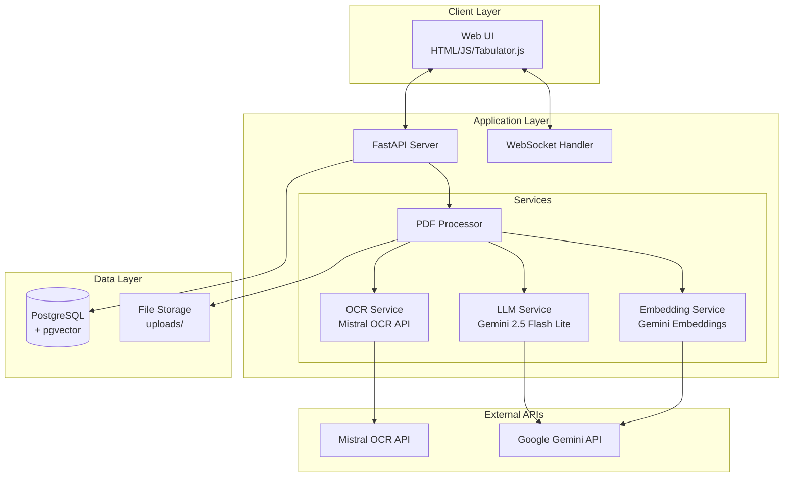

# PDF Question Extractor - System Architecture

## Overview
The PDF Question Extractor is a local application that processes exam papers in PDF format, extracts questions using AI services, allows manual review, and stores approved questions in a PostgreSQL database with vector embeddings for semantic search.

## Architecture Diagram



## Component Architecture

### 1. Frontend Layer
- **Technology**: Vanilla HTML5/CSS3/JavaScript with Tabulator.js
- **Key Features**:
  - Bulk PDF upload interface
  - Real-time processing status via WebSocket
  - Tabulator.js data grid for question review
  - Auto-save with 1-second debounce
  - Bulk approve/reject operations
  - CSV export functionality

### 2. API Layer (FastAPI)
- **Framework**: FastAPI 0.115+ with async/await
- **Key Endpoints**:
  ```
  POST   /api/upload          - Upload PDF files/folder
  GET    /api/process/{id}    - Get processing status
  GET    /api/questions       - Get paginated questions
  PUT    /api/questions/{id}  - Update single question
  POST   /api/questions/bulk  - Bulk operations
  POST   /api/questions/save  - Save approved to permanent DB
  GET    /api/export          - Export to CSV/JSON
  GET    /api/health          - Health check
  WS     /ws/processing       - Real-time processing updates
  ```

### 3. Service Layer

#### OCR Service (ocr_service.py)
- Integrates with Mistral OCR API
- Handles PDF to Markdown conversion
- Implements retry logic with tenacity
- Caches processed results

#### LLM Service (llm_service.py)
- Uses Gemini 2.5 Flash Lite for question extraction
- Implements structured output with Pydantic schemas
- Smart chunking for large documents
- Cost optimization through batching

#### Embedding Service (embedding_service.py)
- Generates 768-dimensional vectors using Gemini
- Batch processing for efficiency
- Versioning support for embeddings

#### PDF Processor (pdf_processor.py)
- Orchestrates the complete pipeline
- Handles folder-based processing
- Manages temporary storage
- Coordinates all services

### 4. Data Layer

#### PostgreSQL Database
- **Version**: PostgreSQL 16+ with pgvector 0.8.0+
- **Tables**:
  - `extracted_questions` - Temporary storage for review
  - `questions` - Permanent storage for approved questions
  - `question_embeddings` - Vector embeddings for semantic search
- **Indexes**:
  - HNSW index for vector similarity
  - GIN indexes for array and JSONB fields
  - Full-text search indexes

#### File Storage
- `/uploads` - Temporary PDF storage
- `/logs` - Application logs
- Volume-mounted in Docker for persistence

## Data Flow

### 1. PDF Upload Flow
```
User uploads PDFs → API receives files → Store in /uploads → 
Create processing job → Return job ID → WebSocket connection established
```

### 2. Processing Pipeline
```
For each PDF:
1. OCR Service → Mistral API → Markdown with structure
2. LLM Service → Gemini API → Extract questions with metadata
3. Store in extracted_questions table (temporary)
4. Embedding Service → Generate vectors → Store in question_embeddings
5. Send progress updates via WebSocket
```

### 3. Review Flow
```
Frontend loads extracted questions → User reviews/edits → 
Auto-save on change → Update status (approved/rejected) → 
Bulk save approved → Move to permanent questions table
```

## Security Architecture

### API Security
- API key management via environment variables
- Request validation with Pydantic
- Rate limiting on endpoints
- CORS configuration for local access

### Database Security
- Connection pooling with secure credentials
- Read-only user for MCP integration
- Parameterized queries to prevent SQL injection
- Row-level security for multi-user support (future)

### Data Privacy
- Local-only execution
- No data leaves the local environment except API calls
- Temporary files cleaned up after processing
- Sensitive data never logged

## Performance Optimization

### Caching Strategy
- Processed PDF results cached to avoid re-processing
- Database connection pooling
- Frontend pagination for large datasets
- Batch API operations

### Async Processing
- FastAPI async endpoints
- Concurrent PDF processing
- Non-blocking database operations
- WebSocket for real-time updates

### Resource Management
- Docker resource limits (2GB RAM, 2 CPU cores)
- File size limits (50MB per PDF, 1000 pages)
- Batch processing for API calls
- Connection pooling (10 connections, 20 overflow)

## Scalability Considerations

### Horizontal Scaling (Future)
- Redis for distributed caching
- Celery for background task processing
- Multiple worker processes
- Load balancing

### Vertical Scaling
- Increase Docker resource limits
- PostgreSQL performance tuning
- Larger connection pools
- More concurrent workers

## Error Handling

### Service Resilience
- Retry logic with exponential backoff
- Circuit breaker pattern for external APIs
- Graceful degradation
- Comprehensive error logging

### Data Integrity
- Database transactions for atomic operations
- Validation at every layer
- Audit trail for changes
- Backup and recovery procedures

## Monitoring & Observability

### Logging
- Structured JSON logging with structlog
- Log aggregation in Docker
- Different log levels per environment
- Request ID tracking

### Metrics (Future)
- Prometheus metrics endpoint
- Processing time metrics
- API usage statistics
- Error rate monitoring

### Health Checks
- Database connectivity
- External API availability
- File system access
- Memory and CPU usage

## Development Workflow

### Local Development
```bash
# Start services
docker-compose -f docker-compose.dev.yml up

# Access application
http://localhost:8000

# View API docs
http://localhost:8000/docs
```

### Testing Strategy
- Unit tests for services
- Integration tests for API
- End-to-end tests with Playwright
- Performance benchmarks

### Deployment
- Docker containers for consistency
- Environment-based configuration
- Health checks for orchestration
- Rolling updates

## Technology Choices Rationale

### FastAPI
- Modern async support
- Automatic API documentation
- Built-in validation
- WebSocket support

### PostgreSQL + pgvector
- Proven reliability
- Native vector operations
- ACID compliance
- Rich querying capabilities

### Mistral OCR
- High accuracy (94.9%)
- Handles complex layouts
- Structured output
- Multilingual support

### Gemini 2.5 Flash Lite
- Large context window (1M tokens)
- Structured JSON output
- Cost-effective
- Low latency

### Docker
- Consistent environments
- Easy deployment
- Resource isolation
- Development parity